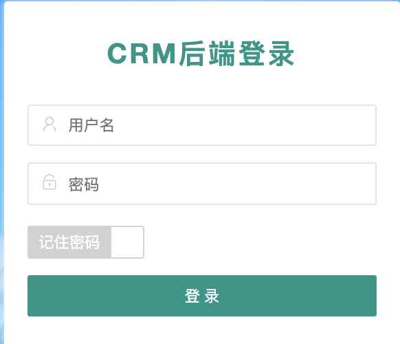
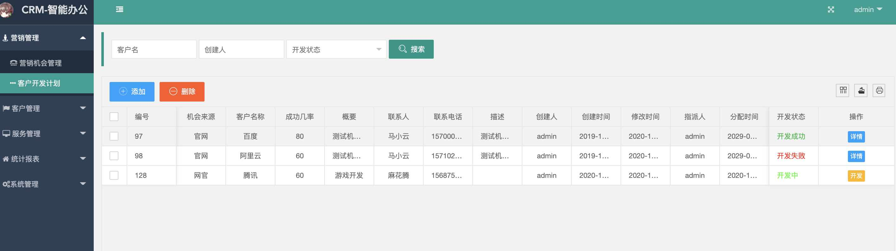
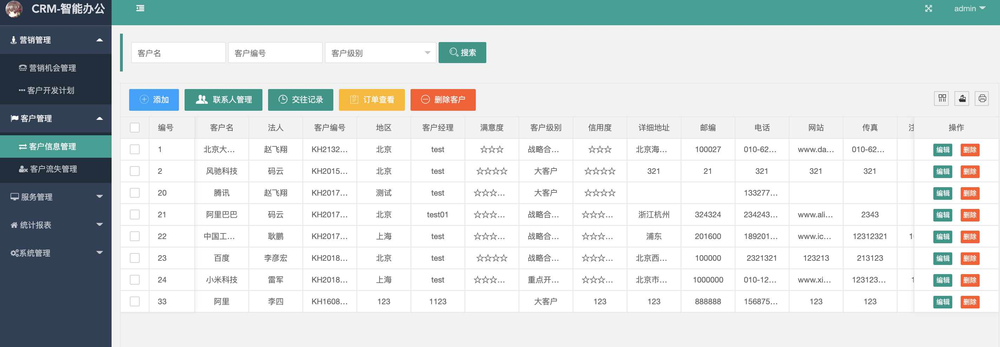
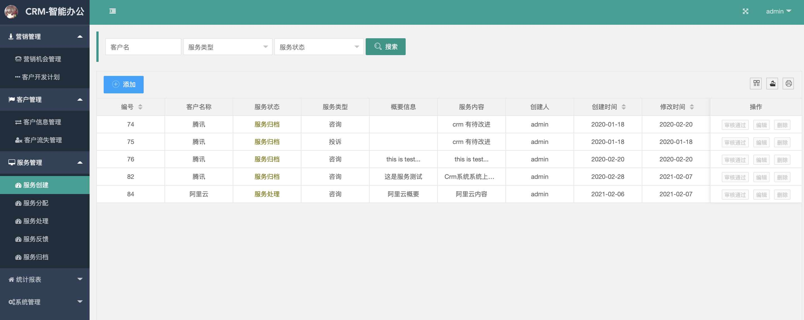
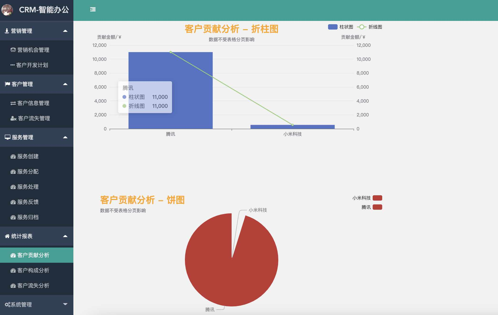
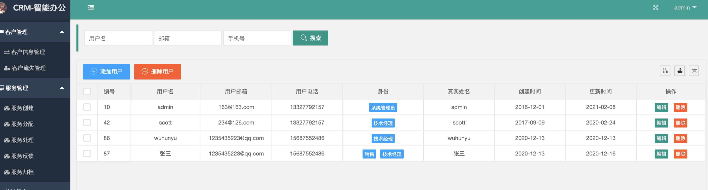

基于Springboot的crm客户关系管理系统
=
### 完整代码获取地址：从戎源码网 ([https://armycodes.com/](https://armycodes.com/))
### 作者微信：19941326836  QQ：952045282 
### 承接计算机毕业设计、Java毕业设计、Python毕业设计、深度学习、机器学习
### 选题+开题报告+任务书+程序定制+安装调试+论文+答辩ppt 一条龙服务
### 所有选题地址https://github.com/nature924/allProject

一、项目介绍
---
基于Springboot框架实现的crm客户关系管理系统包有一种角色：管理员、主要功能如下。

1. 营销管理：管理员可以管理营销活动，包括创建、编辑和删除营销机会。
2. 客户开发计划：管理员可以制定客户开发计划，包括拜访计划、电话联系计划等。
3. 客户管理：管理员可以管理客户信息，包括添加、编辑和删除客户信息。
4. 客户信息管理：管理员可以查看和编辑客户的详细信息，包括联系人、联系方式等。
5. 客户流失管理：管理员可以跟踪和处理客户流失情况，包括分析流失原因、制定挽回计划等。
6. 服务管理：管理员可以管理客户服务，包括创建、分配、处理和归档服务请求。
7. 统计报表：管理员可以生成各种统计报表，包括客户贡献分析、客户构成分析和客户流失分析等。

二、项目技术
---
- 编程语言：Java
- 数据库：MySQL
- 项目管理工具：Maven
- 前端技术：VUE、HTML、Jquery、Bootstrap
- 后端技术：Spring、SpringMVC、MyBatis

三、运行环境
---
- 操作系统：Windows、macOS都可以
- JDK版本：JDK1.8以上都可以
- 开发工具：IDEA、Ecplise、Myecplise都可以
- 数据库: MySQL5.7以上都可以
- Tomcat：任意版本都可以
- Maven：任意版本都可以

四、运行截图
---

### 程序截图：

